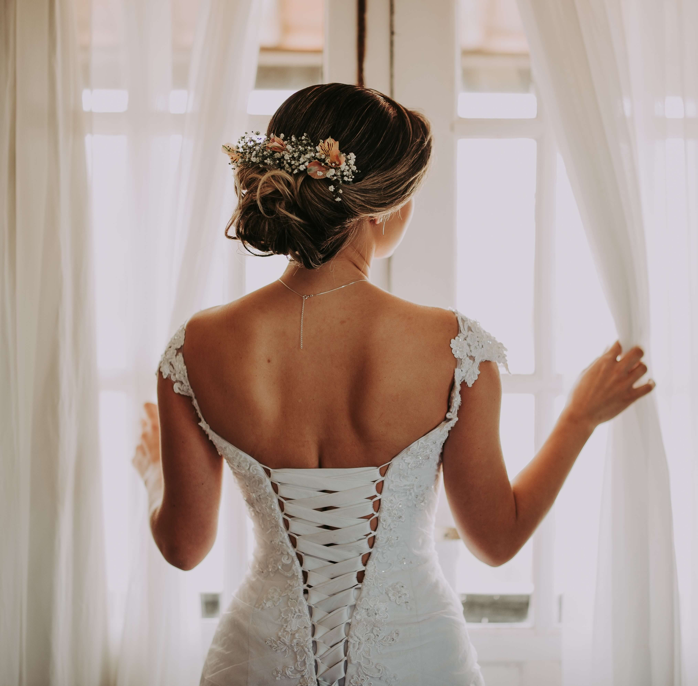

# Project 1, Corsetry
My first project since enrolling in the Code Institute's full-stack developer course. I chose to go the historical route and chose a historical item that personally interests me. 

# **The Corsetry**
## **Site Overview**
 I have created a website for an independent corset designer based in France. She specializes in crafting custom-made corsets and is passionate about educating visitors on the subject while dispelling common myths. This is achieved by linking to relevant articles on other pages and providing comprehensive information on her own. The website primarily caters to historical fashion enthusiasts seeking bespoke corsets. Additionally, it serves as a valuable resource for those curious and eager to learn more about corsets

[Click here to visit the live site] (https://widianne.github.io/p1-corsetry/)

​
## Table of contents:
1. [**Site Overview**](#site-overview)
1. [**Planning stage**](#planning-stage)
    * [***Target Audiences***](#target-audiences)
    * [***User Stories***](#user-stories)
    * [***Site Aims***](#site-aims)
    * [***Wireframes***](#wireframes)
    * [***Color Scheme***](#color-scheme)
    * [***Typography**](#typography)
1. [**Current Features Common to all pages**]
(#current-features-common-to-all-pages)
    * [***Header Element:***](#header-element)
    * [***The rest of your features***](#features)
    * [**Footer**](#footer)
1. [**Future-Enhancements**](#future-enhancements)
1. [**Testing Phase**](#testing-phase)
1. [**Deployment**](#deployment)
1. [**Tech**](#tech)
1. [**Credits**](#credits)
    * [**Honorable mentions**](#honorable-mentions)
    * [**General reference**](#general-reference)
    * [**Content**](#content)
    * [**Media**](#media)
​
## **Planning stage**
### **Target Audiences:**
​
This section is a breakdown of the target audience 3 or 4 bullet points so using our example
​
* Users interested historical fashion
* Users interested in getting a custom made corset
* Users interested in learning more about the history behind corsets
​
### **User Stories:**
​
User stories are more what the user wants from the site in terms of features and presentation
​
* As a user, I want to instatly understand what the page is about and who is behind it.
* As a user, I want to easily navigate on the page to find what I need (information about the corset maker, historicly accurete information about corsets and how I can order one)
* As a user, I want to learn more about what the business offers
* As a user, I want to reach out and contact the business with a form to get further information
​
### **Site Aims:**
​
This is optional but offers the insight into what the aim of the project are
​
* To make it easy for the user to contact the corsetmaker by a form
* To inform the user on from what centuries corsets can be made
* To offer the user diffrent opptions on how and where to get information on corsets
​

​
### **Color Scheme:**

When selecting the colors for the site, it was important to me to convey that this is a slow fashion brand. I believe that the dark green creates a calming and reassuring impression for visitors. The lighter green provides a nice contrast and offers a glimpse of Ava's personality – she is both fun and professional. I aimed to maintain a somewhat minimal color scheme to emphasize that, for the maker, only one thing truly matters here, good corsets.

## **Typography**
​
Here is a chance to discuss the fonts used and again why, doesn't need to be crazy detail
​
* Throughout the page, there are two fonts used:
  * Roboto Mono - For the body to give it a strong presence and a bit of a old gazette.
  * Playfair Display - For all headings including the navbar to give the site a romatic femme feel. 

* They were both selected to complement each other and because they give a good balance between old and modern
* All fonts were sourced from Google fonts.
​
## **Current Features Common to all pages**
​
#### *Navigation Bar:*
This is an example of the features section, your going to talk about each section of the page and what it offers for the navbar for example
​
* The user is given links to each section of the page in the nav bar, if you click on ex 'Get in touch' you'll get to the form
* Each option is presented in a way that is always obvious and readable to the user with descriptive titles and corresponding paragraphs, broken up with imagery to give the site some air.
* on the smallets screen there is drop down menu is provided to ensure mobile users have an optimal experience
​
#### *features
​
* Footer holds all the social media links
​
## **Future-Enhancements**
​
* As this marks my inaugural project, my primary focus has been on learning and comprehending the process. I am pleasantly surprised by the results, but there is certainly room for improvement.

* In the future, I aim to delve deeper into the finer details, especially concerning the dimensions of various elements, such as images, text, and the submission button. I believe refining these proportions will enhance the page's overall aesthetics and user experience.

* Given the opportunity, I would like to present external links on charming post-it notes or other playful elements to make them more engaging.

* Working on the mobile version posed challenges, mainly related to element sizing. For instance, the header/hero image appeared disproportionately small, and the gap between it and the navigation required adjustments. Additionally, I envisioned enlarging the map in the mobile version.
​
## **Testing Phase**
​
This is the hardest bit of the readme, when we have completed a page we need to discuss testing.
​
Here is a good idea to talk about how and why you have tested with certain tools and validators so here a list of things to talk through
​
* Responsiveness - I tested the website's adaptability across various devices such as phones, tablets, and computers using Chrome's inspect tool. I encountered initial challenges with the @media queries, but I noticed some improvement in my understanding towards the end of the project

* Functionality - I clicked around and it seems to be working fine
​
* Validators - Here include images from w3c html validator and css jigsaw (jshint for js and pep8 for python) and the results that came from it

### HTML Validation

- Date and Time: [October 31, 2023, 3:00 PM]
- File(s) Checked: [index.html]
- Validator Used: [https://validator.w3.org/]
   
- The issues appereing were to toake away the   and I did even tho oddy it says I didn't.
 
* the result here and on the site [https://validator.w3.org/nu/?doc=https%3A%2F%2Fwidianne.github.io%2Fp1-corsetry%2F]

Info: Trailing slash on void elements has no effect and interacts badly with unquoted attribute values.

From line 4, column 5; to line 4, column 28

head>↩    <meta charset="UTF-8" />↩    <

Info: Trailing slash on void elements has no effect and interacts badly with unquoted attribute values.

From line 5, column 5; to line 5, column 76

8" />↩    <meta name="viewport" content="width=device-width, initial-scale=1.0" />↩    <

Info: Trailing slash on void elements has no effect and interacts badly with unquoted attribute values.

From line 7, column 5; to line 10, column 6

ns-->↩    <meta↩      name="description"↩      content="Corset, Corsetry, Paris, Fashion Design, Custom made, Independent Design, Historical fashion"↩    />↩    <

Info: Trailing slash on void elements has no effect and interacts badly with unquoted attribute values.

From line 12, column 5; to line 15, column 6

te-->↩    <meta↩      name="kewords"↩      content="corset, corsetry, handmade, paris, sewing, design, independent, historical, history"↩    />↩    <

Info: Trailing slash on void elements has no effect and interacts badly with unquoted attribute values.

From line 17, column 5; to line 21, column 6

on-->↩    <link↩      rel="icon"↩      type="image/icon"↩      href="assets/favicon/hat-wizard-solid.svg"↩    />↩    <

Info: Trailing slash on void elements has no effect and interacts badly with unquoted attribute values.

From line 22, column 5; to line 22, column 73

   />↩    <link href="assets/css/style.css" rel="stylesheet" type="text/css" />↩    <

Info: Trailing slash on void elements has no effect and interacts badly with unquoted attribute values.

From line 31, column 7; to line 31, column 65

el>↩      <input type="checkbox" id="nav-toggle" name="nav-toggle" />↩↩    

Info: Trailing slash on void elements has no effect and interacts badly with unquoted attribute values.

From line 43, column 6; to line 47, column 8

ain>↩     ↩↩    

Info: Trailing slash on void elements has no effect and interacts badly with unquoted attribute values.

From line 52, column 11; to line 52, column 70

          ↩↩    

Info: Trailing slash on void elements has no effect and interacts badly with unquoted attribute values.

From line 70, column 11; to line 74, column 12

          ↩↩    

Info: Trailing slash on void elements has no effect and interacts badly with unquoted attribute values.

From line 98, column 11; to line 102, column 12

          ↩     

Info: Trailing slash on void elements has no effect and interacts badly with unquoted attribute values.

From line 106, column 11; to line 110, column 12

          ↩     

Warning: Section lacks heading. Consider using h2-h6 elements to add identifying headings to all sections, or else use a div element instead for any cases where no heading is needed.

From line 111, column 11; to line 111, column 19

          <section>↩     

Info: Trailing slash on void elements has no effect and interacts badly with unquoted attribute values.

From line 126, column 11; to line 130, column 12

          ↩     

Error: Element br not allowed as child of element ul in this context. (Suppressing further errors from this subtree.)

From line 146, column 15; to line 146, column 20

           ↩     

Contexts in which element br may be used:
Where phrasing content is expected.
Content model for element ul:
Zero or more li and script-supporting elements.
Info: Trailing slash on void elements has no effect and interacts badly with unquoted attribute values.

From line 146, column 15; to line 146, column 20

           ↩     

Error: Element br not allowed as child of element ul in this context. (Suppressing further errors from this subtree.)

From line 156, column 15; to line 156, column 20

           ↩     

Contexts in which element br may be used:
Where phrasing content is expected.
Content model for element ul:
Zero or more li and script-supporting elements.
Info: Trailing slash on void elements has no effect and interacts badly with unquoted attribute values.

From line 156, column 15; to line 156, column 20

           ↩     

Error: Element br not allowed as child of element ul in this context. (Suppressing further errors from this subtree.)

From line 166, column 15; to line 166, column 20

           ↩     

Contexts in which element br may be used:
Where phrasing content is expected.
Content model for element ul:
Zero or more li and script-supporting elements.
Info: Trailing slash on void elements has no effect and interacts badly with unquoted attribute values.

From line 166, column 15; to line 166, column 20

           ↩     

Warning: Section lacks heading. Consider using h2-h6 elements to add identifying headings to all sections, or else use a div element instead for any cases where no heading is needed.

From line 131, column 11; to line 131, column 32

          <section class="pl-1">↩     

Info: Trailing slash on void elements has no effect and interacts badly with unquoted attribute values.

From line 192, column 13; to line 192, column 57

          <input type="text" id="fname" name="fname" />↩     

Info: Trailing slash on void elements has no effect and interacts badly with unquoted attribute values.

From line 195, column 13; to line 195, column 57

          <input type="text" id="lname" name="lname" />↩     

Info: Trailing slash on void elements has no effect and interacts badly with unquoted attribute values.

From line 198, column 13; to line 198, column 58

          <input type="email" id="email" name="email" />↩     

Warning: Section lacks heading. Consider using h2-h6 elements to add identifying headings to all sections, or else use a div element instead for any cases where no heading is needed.

From line 181, column 7; to line 181, column 42

n>↩↩      <section id="section3" class="mt-1">↩  

### CSS Validation

- Date and Time: [October 31, 2023, 3:00 PM]
- File(s) Checked: [style.css]
- Validator Used: [https://jigsaw.w3.org/css-validator/]
   
* the imgs were to big but have been down sized
* fixed the font problem (i think)
* not sure about the last error and how to fix it...

* the result here and on the site [https://jigsaw.w3.org/css-validator/validator?uri=https%3A%2F%2Fwidianne.github.io%2Fp1-corsetry%2F&profile=css3svg&usermedium=all&warning=1&vextwarning=&lang=sv]

3 File not found: https://fonts.google.com/specimen/Playfair+Display?preview.text=the%20corsetry%0A: You can't import an HTML document

Line 58 - #menu > li: Value error: margin-bottom Too many values or values can be recognized: 4 em.
​
## **Bugs**
​
We always have bugs in development, a few bullet points here to talk about bugs you found and how you fixed them, in later projects this will be more detailed
​
* image troubles in regards to sizing and positioning on phone

* header img looking weird, considerd taking it away
​
***
## **Deployment**
I deployed the page on GitHub pages via the following procedure: -
​
1. From the project's [repository](pageurl), go to the **Settings** tab.
2. From the left-hand menu, select the **Pages** tab.
3. Under the **Source** section, select the **Main** branch from the drop-down menu and click **Save**.
4. A message will be displayed to indicate a successful deployment to GitHub pages and provide the live link.
​
* Yes I did exactly this step 1 - 4
You  can find the live site via the following URL - [live webpage](https://widianne.github.io/p1-corsetry/)
***
​
## **Tech**
​
Here mention what technologies you've used for example
​
* Website only made with:
- HTML
- CSS
- VSC
- W3C
​
## **Credits**
### **Honorable mentions**
​
Thanks to my Mentor!
​
### **Content:**
​
I based some of my code on the Love Running CI code but made changes
  
### **Media:**
​
* All imgs are from https://unsplash.com/

The imgs
* Fabric
https://unsplash.com/photos/woman-holding-green-textile-inside-room-BCNjBsK37XA

* Hero
https://unsplash.com/photos/floral-artwork-on-surface-d2zvqp3fpro

* Thread
https://unsplash.com/photos/assorted-color-thread-in-bowl-beside-three-roses-on-two-hardbound-books-TYhEoWbbayQ

* Corset
https://unsplash.com/photos/woman-in-wedding-dress-standing-near-window-looking-outside-while-holding-the-curtains-Efd5oh-nQWI

* Ava
https://unsplash.com/photos/a-woman-with-a-ring-on-her-finger-3FDpB6TD6_o

* Sewing machine
https://unsplash.com/photos/a-close-up-of-a-sewing-machine-on-a-table-1urO7XN3zuA